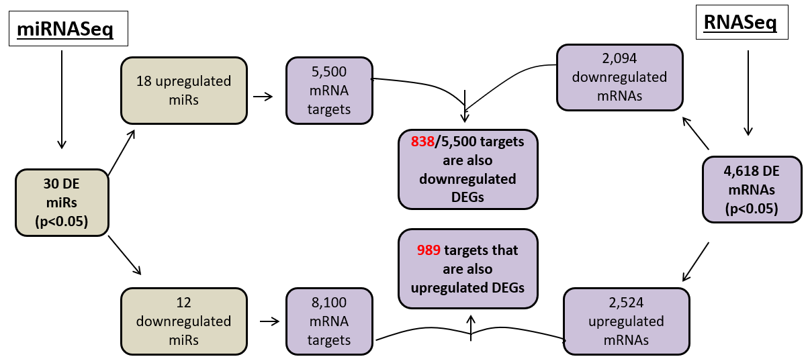

# Differential expression from both RNASeq and miRNASeq

## RNASeq Analysis approach:
**Goal:** determine differentially expressed genes between CM/controls, but more imporantly: between Controls, CM samples with TTN variants, and CM samples with no TTN variants. 
Essentially, trying to **stratify CM samples into two groups, with two potential mechanisms of action**: TTN+ and TTN-

**Steps:**
1. RNASeq DE (DESeq2 used throughout): comparing CM to controls. This analysis has been performed by many other groups, including here for comparison purposes.
2. RNASeq DE: TTN+ vs TTN- vs Controls
3. Overlap analysis of #2: how many DEGs are found in just TTN+? Just TTN-? Shared between the two?
4. Pathway analysis: do the TTN+/TTN- specific DEGs act through different pathways? How does this compare to the common CM pathways (from #1 DEGs)

Graphical summary of approach (steps 2-4):

## miRNASeq Analysis approach:
**Goal:** Identify potential miRNA biomarkers of DCM. In addition, identify miRNAs with high disease association by comparing differentially expressed miRNAs to their differentially expressed mRNA targets. Determine what pathways the targets of this subset of miRNAs act in.

Graphical summary of approach:

